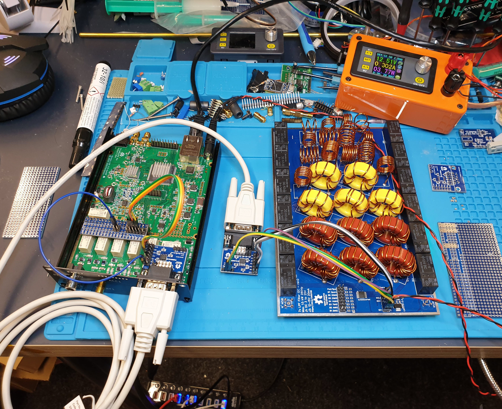
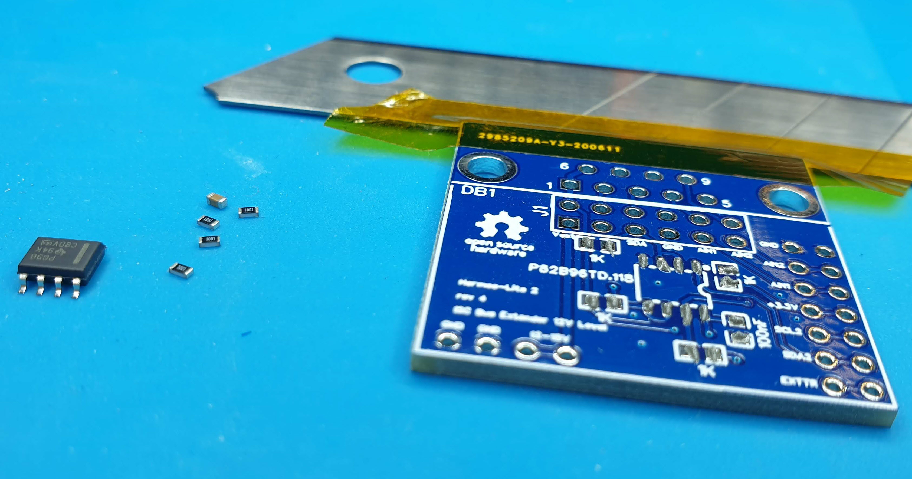
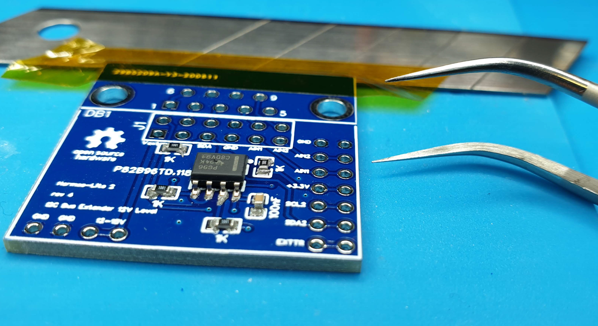
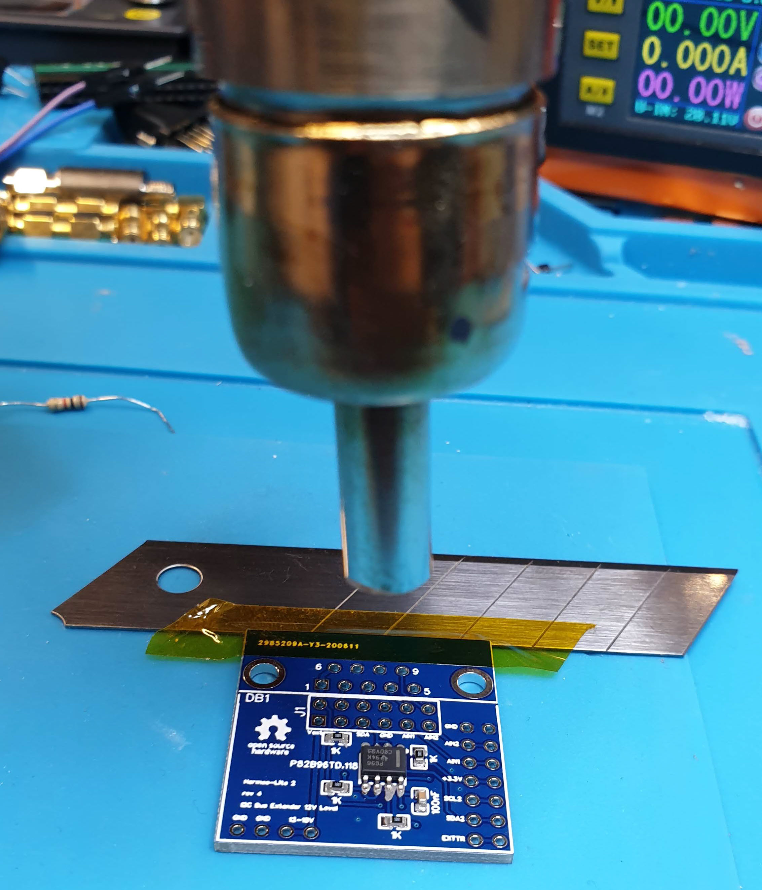

# I2C-Bus-extender
extend the range of I2C connections by modulating with an active driver, allows for 200m distance

Principally I like the I2C bus, and it is very widely used to talk between components on a pcb level. But higher capacitance and inducted RF puts the little guy at risk to loose data. So I put some effort in understanding the limits, and it came clear that there is a significant improvement inside a compartment if you increase the current on the bus by having proper pull up resistors. 4k7 is the default for 5V bus. on 3v3 bus better 2k2. i1k seems the maximum the usual semis can drive to zero. But the shape when looked on the oscilloscope is greatly improved.

###### This is only a small part of my overall PA500 project

[Link to full project diary](https://bit.ly/30hMFdh)

You might be elevated to watch more pcb-porn - see the [LPF filter section](https://bit.ly/3dGUY66) there

## Leaving the box

well, connecting anything to this bus outside of the case is putting the board at risk, and endangers the integrity of the bus. Therefore it is useful to transform the signal to a more robust bus like modbus,can bus or similar. But that is quite a task, one must define new commands, implement converters,etc. whatever.

The solution came from TI having a bus driver developed exactly for the purpose

### P82B96

[Datasheet](https://www.ti.com/lit/ds/symlink/p82b96.pdf?ts=1593359005466&ref_url=https%253A%252F%252Fwww.ti.com%252Fproduct%252FP82B96%253Futm_source%253Dgoogle%2526utm_medium%253Dcpc%2526utm_campaign%253Dasc-null-null-GPN_EN-cpc-pf-google-eu%2526utm_content%253DP82B96%2526ds_k%253DP82B96%2526DCM%253Dyes%2526gclid%253DCjwKCAjw_-D3BRBIEiwAjVMy7G5qxsvwfxLvoI9qvvvXimi5iXlMqIplM2xG1SZRruiqwSxxvto6rhoCjSkQAvD_BwE%2526gclsrc%253Daw.ds)


It allows us to simply inject 12V on either side of the comm (anything between 3-15V works), and get a very robust signal to go far away and be stable. Also each 3v3 bus of both participants remain integer and unaffected by each other electrically. I didn't go that far to make it galvanic separated, as my test shows really robust behaviour with its simplest implementation.

It even cooler, either side of the I2C can be 3v3 or 5V Level. The chip will do what you connect to the "3v3" labelled pins on either side if you have a 5V bus just insert your 5V level. it will work reliably

So I put that chip on a small breakout with a D-SUB9 female connector attached to mount it on a backplane.

### Breakout Connector

original use case was to connect the Hermes-Lite 2 to my homebrew PA500. But I use it now also to wire my mast sensor over 20m distance to the controller. The PCB is very flexible and multi purpose. It allows to jumper different signals to that D-SUB9 cable. 

###### The Schema, pretty basic


|  | The top jumper allows to connect each signal to a D-Sub9 pin. i.e. one could have AIN1,AIN2,EXTTR exchanged alongside the I2C signal for Band selector to the PA connected. But practically any signal can be jumpered here, even if no I2C is used this little board can serve easy connectivity by a robust connector and cable. |
| -------------------------------------------------------- | ------------------------------------------------------------ |
|                             | Top side the D-Sub Jumpers, right side EXTTR,SDA2,SCL2,3v3,AIN1,AIN2,GND this order matches a twisted ribbon connector to the extension jumper header as of here: [HL2 Extension Jumper](https://github.com/pressla/HL2_Extension_Jumper) The bottom provides injection of the external driver voltage. anything between 3-15V is fine. to make sense, above 10V would be useful. in HL2 this pins match the second extension connectors pins for another ribbon connector. Jumper 1 Pin1 enables that Voltage to be used. technically we provide that 12V on either side of the extender and bridge it with this jumper to the other side. This means in HL2 case I will inject the power from the PA through this connection back to power the HL2. This way I dont need a seperate power supply for the HL2. But the other way is just as good. GND is identical for all Busses. |
|    | The gerber view shows the schema also well                   |
|                                    | The design 3D looks very close to the reality, I am really impressed of the workflow with this toolchain. I  was never good with the iron, now this tool is working very well for me. It just allows me to create really working pcbs in a few days, also mechnically excellent results. And the production quality is beyond imagination. |

### Performance Tests

#### [Video of final test](https://www.youtube.com/watch?v=5C07nNBeCo4)

I was interested to what extend these drivers are able to overcome large capacities (long cable), lots of EMD and RF into it and I want to see the maximum data throughput. Well, I used what I have. two arduinos one as a master, second slave. Both chips are not very fast and the ESP-32 has only a crippled wire.h implementation (no receiver) had to find this out first.

ok, sending large blocks up to 32byte (limit of wire.h) and a checksum. counting connection error and data error with 1ms frequency. This makes up to roughly 30kB throughput. That's all I want to know. I was too lazy to switch to a STM32 dev board to get the microseconds.

I tried really, increased the capacity to 2000p which is somewhere 100m cable. Added noise what I have (500W RF with a coupler). And I did not see any lost data. Well impressed. This bus is now similar immune than a modbus or can bus. way more than we can expect.

The sources are in ["test"](https://github.com/pressla/I2C-Bus-extender/tree/master/test) folder

There is also a small test program which switches all LPF Bands per second through. This is stress testing the LPF design too:) I managed to switch maximally 30ms each band. Well, not a use case but I wanted to stress the Darlington array,diodes and caps. All fine.

Some where wondering how the protocol to the MCP23008 looks like. Here it is in "Arduino" language.

```c++
void setup() {
  Wire.begin(pSDA1, pSCL1,I2Cspeed);  // join i2c bus as master
  Serial.begin(115200);             // start serial for output
  Serial.println("Hello HL2 I2C sender");
  setI2CReg(IODIR, 0x80);
  setI2CReg(GPINTEN, 0x80);
  setI2CReg(IOCON, 0x22);
}

void loop() {
  byte chck = 0;
  buffer[0] = 0x0A;   //gpio write mask
  buffer[1] = 1 << x; //shift left bit by x bits
  
  for (int n=0;n<31;n++) chck += buffer[n];
  buffer[31] = chck;
  Wire.beginTransmission(IO); // transmit to device #
  Wire.write(buffer,2); // sends 2 bytes
  byte error = Wire.endTransmission(); // stop transmitting
  String snd = "n=";
  snd = snd+buffer[1]+" errorcount:";
  snd += errorCount;
  Serial.println(snd);

  
  x++;
  if (x>7) {x=0;y++;}
```

### The master+slave block data stress tests:


### Some Signals

Here is an oscilloscope view of the SCL the 12V side and the resulting 3v3 both on receiver side with inducted RF power on a 10m cable.


Here is sender side and receiver side. sure the receiver side is re-generated and the delay is part of the concept. See data sheet, but cool. very cool.


You may have noticed I did a variation of pull ups 1k,4,7k to see the current and signal resilience on the PA side. Here is a 4k7 signal. It became vulnerable with very high RF next to the cirquit. Above 2.2kOhm was significant more resilient. 


### Tests with HL2

Finally of course, want to see if everything works well with the real scenario. HL2 switching my Band filters on my cool LPF board.

The D-Sub cable is a 3$ Amazon basics RS232 standard cable male-male with 1:1 connections, no twists simply straight cable.



Of course - the ribbon cable... Step by step never skip a step. (got the order of pins right...)


The filter board. MCP23008+ULN2003 on 0x20 just the same than the standard HL2 filter board inside Hermes.


# [Video of final test](https://www.youtube.com/watch?v=5C07nNBeCo4)

I switched between 1.8 and 3.8 Mhz on the SDR console

### How do I make some for myself?

You can simply upload the gerber files in the folder [gerber](https://github.com/pressla/I2C-Bus-extender/tree/master/gerber) or go to easyeda online editor, the full project is open to you for cloning, making changes and order directly from that tool at JLCPCB. You will get an online quote when pressing the "create gerber" button in the pcb view. You will order minimum 10pcs... But as said - any other I2C connect your garden sensor to your station, or whatever. Now its possible to go far.


### [Link to EasyEDA Project](https://bit.ly/38btZO1)


## SMD Soldering - freaking easy

a few pictures how the soldering process is done. after placing the parts you are done in 5 minutes with a 10$ hot gun and a few ml of solder paste. The PCBs are excellent, the footprints match. You will recieve them hot soldered, so no corrosion issues or whatever. I saw hundreds of 0201 parts centering perfect, no tombstones, nicely self righting. 


##### The amount of solder should be not too much








### [See this video in realtime 1 min job](https://www.youtube.com/watch?v=OENJgHOmRL0)


